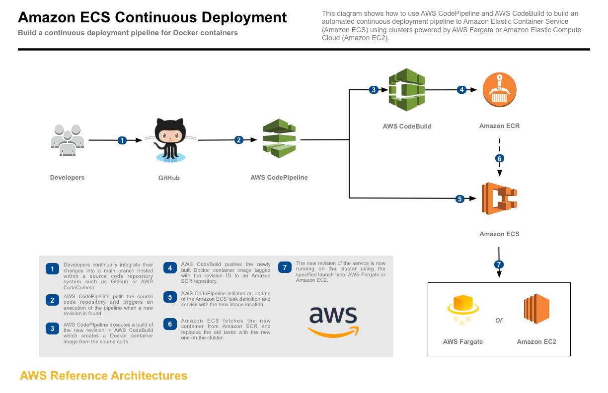

# CI/CD pipeline for node app

Deploy node js app by using aws pipeline and aws ecs.

## Pipeline Architecture
[][architecture]

## Getting Started

1. Provision pipeline by using provision_pipeline template.
2. Provision s3 to store lambda source code.
2. Provision lambda by using provision_lambda template.
3. Configure fargate by using provision_fargate template.

### Prerequisites

1. CloudFormation: Provision all aws resources for CI/CD.
2. AMI: grant access to resources.
3. CloudWatch: Watch pipeline and codebuild changes trigger lambda call.
4. Lambda: Call slack API send message to slack channel.
5. Pipeline : Orchestrate CI/CD workflow.
6. Codebuild: Run test and build docker images.
7. ECR: Upload images into ECR.
8. ECS: Deploy docker conainter.

### Parameters need to configure

1. AWS info.
1. Github info.
2. Slack webhook url.
3. ECR info.

### Notes

1. Security group need to allow tcp to access contianer app.
2. Yaml format very sensitive.

